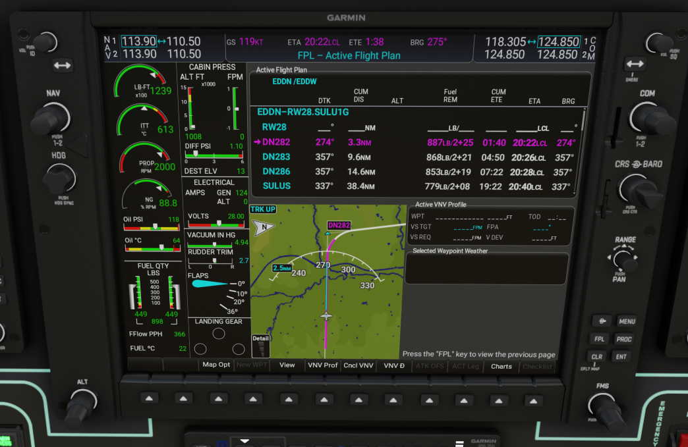

## Wide View Plugin for the WorkingTitle G1000 Avionics Package

### Specifically tailored to the FSR500 by FSReborn.
###



### Patches to MFD_FSR.js:
#### Additional exports:

```typescript
exports.FixInfo = FixInfo;
exports.FPLDetails = FPLDetails;
exports.FPLDetailsController = FPLDetailsController;
exports.FPLDetailsStore = FPLDetailsStore;
exports.FPLEmptyRow = FPLEmptyRow;
exports.FPLApproach = FPLApproach;
exports.FPLArrival = FPLArrival;
exports.FPLDeparture = FPLDeparture;
exports.FPLDestination = FPLDestination;
exports.FPLEnroute = FPLEnroute;
```
#### MFDUiPage

```typescript
class MFDUiPage extends UiPage {
    constructor() {
        super(...arguments);
        this.isSoftkeyMenuHidden = false;
    }

    [...]

    // Patch applied here to store the selected FPL view style
    /**
     * This method is called when a FPL button event occurs.
     * @returns whether the event was handled.
     */
    onFPLPressed() {
        if (window.fplWideViewActive) {
            this.props.viewService.open('FPLWidePage');
        } else {
            this.props.viewService.open('FPLPage');
        }
        return true;
    }

    [...]
}
```

#### MFDSelectDepArr

```typescript
class MFDSelectDepArr extends SelectDepArr {
    constructor() {
        super(...arguments);
        [...]
    }
    
    [...]
    
    /**
     * A callback which is called when the Load action is executed.
     */
    onLoadSelected() {
        this.controller.onLoadSelected();
        if (window.fplWideViewActive) {
            this.props.viewService.open('FPLWidePage');
        } else {
            this.props.viewService.open('FPLPage');
        }
    }
```